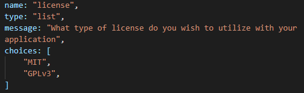
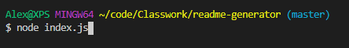
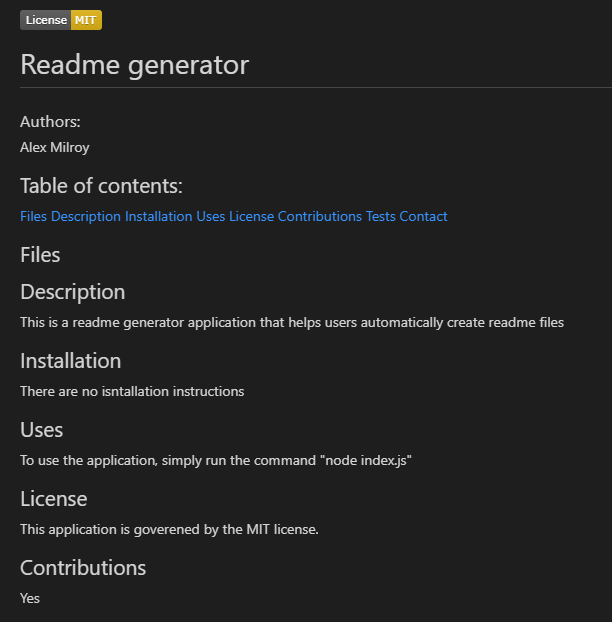

# Readme Generator

## Authors: 
Alex Milroy  

## Table of contents:
* [Files](#Files)
* [Description](#Description)
* [Installation](#Installation)
* [Uses](#Uses)
* [License](#License)
* [Contributions](#Contributions)
* [Tests](#Tests)
* [Contact](#Contact)

## Files
* index.js
* package-lock.json
* package.json
* readme.md
* .gitignore
* how to add more licenses.png
* initilization.png
* output.png

## Description
This is a readme genereator application that helps users automatically create readme files. It uses a module called prompt that is utilized to ask the user a number of questions about the information they with to include in their readme file. Once the user answers all the questions, their input is automatically inserted into a readme file with existing markup. This saves the user time by not having to enter any markup to style their readme, they can simply provide the content for each section through the terminal prompts.

A video walkthrough of the program is available to view at : https://drive.google.com/file/d/1O3TSN2eVNroN0a699o3KRFn9RLWO2dSF/view

## Installation
Copy all files into a working directory, and open an integrated terminal window. Once open, ensure the terminal has the correct folder open. Type "node index.js" into the terminal window, and if you are prompted for answers the program has been installed correctly.

## Uses
Use this application to more quickly and easily build readme files for any project or application you have created.

## License
This application is goverened by the MIT license.

## Contributions
Yes

## Tests
run node index.js and follow the prompts. Once complete, check the readme files to ensure it was written correctly
    
## Contact:
github.com/ajm5099
github.com/amilroy@gmail.com

## Images:

